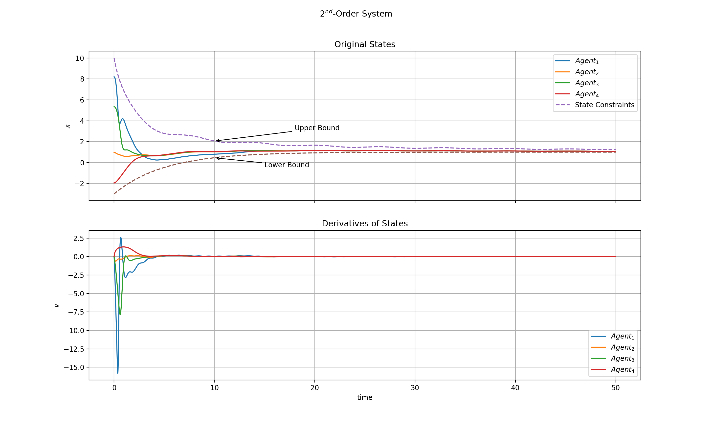



# ConstrAined ModEl Reference Adaptive conSensus: a framework

## Description

-   Consensus of multi-agent systems (MASs) has wide applications and many consensus algorithms have been proposed. However, state-of-the-art algorithms do not work well in realistic conditions. On the one hand, MASs in real-life scenarios are subject to various constraints, e.g. kinematic constraints, actuator saturation, safety concerns, etc., along with uncertainties and disturbances. On the other hand, most algorithms assume that any point in the state spaces of agents is reachable and therefore they do not have guarantees on not breaking the predesignated constraints.

 
(Fig. 1: Consensus subject to time-varying state constraints)

 

-   In this project, we investigate **distributed consensus** control algorithms for MASs with **time-varying state constraints**, uncertainties and external disturbances. We hope to extend applications of MASs into realistic scenarios involving the above conditions.  

 
 

## Contributions

-   We have proposed a distributed leaderless consensus framework for a class of continuous-time nonlinear MASs with time-varying asymmetric state constraints, uncertainties, and disturbances under time-varying directed topologies. 
-   In the presence of bounded disturbances, continuous uncertainties in agents' models, and **time-varying constraints on agents' positions**, consensus control algorithms under the CAMERAS framework for MASs consisting of agents governed by first- or second-order dynamics have been put forward and validated theoretically and numerically.  

 
(Fig. 2: Numerical simulation results of four double integrators achieving consensus under switching directed topologies.) 

 

-   Simulations powered by [the Robotarium](https://www.robotarium.gatech.edu/)[^1] have shown the effectiveness of our algorithms. See Fig. 3.  

 
(Fig. 3: Six robots rendezvous under switching directed topologies subject to time-varying constraints) 

 

- A demo video of running distributed consensus algorithms under the CAMERAS framework on physical robots (powered by the Roboratium). 

<iframe width="800" height="600" src="https://www.youtube.com/embed/VakMkkff5s0?&autoplay=1&loop=1&playlist=VakMkkff5s0" title="CAMERAS" frameborder="0" allow="accelerometer; autoplay; clipboard-write; encrypted-media; gyroscope; picture-in-picture;loop" allowfullscreen></iframe>
 
(YouTube link  <a href="https://www.youtube.com/watch?v=VakMkkff5s0">here</a>)

 

<iframe height="600" width="800" src="//player.bilibili.com/player.html?aid=887621553&bvid=BV1MK4y1P7vd&cid=322449230&page=1" scrolling="no" border="0" frameborder="no" framespacing="0" allowfullscreen="true"> </iframe>
 
(bilibili link for friends inside the GFW <a href="https://www.bilibili.com/video/BV1MK4y1P7vd/">here</a>)

 
 

## Related publications

-   **Details are disclosed in our paper**. The paper is still under review, so, for the time being, please refer to an abstract [here](/files/abstr-Luan_distributed_2021_TNNLS.pdf). 

 
 

## Extension: CAMERAS-PRO

-   On the basis of *CAMERAS*, we will work on constrained consensus with both time-varying state constraints and **prescribed performance**. 
-   We aim to tackle prescribed consensus performance under a modified version of *CAMERAS* called **C**onstr**A**ined **M**od**E**l **R**eference **A**daptive con**S**ensus with **P**resc**R**ibed perf**O**rmance (*CAMERAS-PRO*). 
-   More on this later, stay tuned.

 
 

[^1]: Pickem, Daniel, *et al*. "The robotarium: A remotely accessible swarm robotics research testbed." *2017 IEEE International Conference on Robotics and Automation (ICRA)*. IEEE, 2017. Available at [*https://ieeexplore.ieee.org/abstract/document/7989200*

