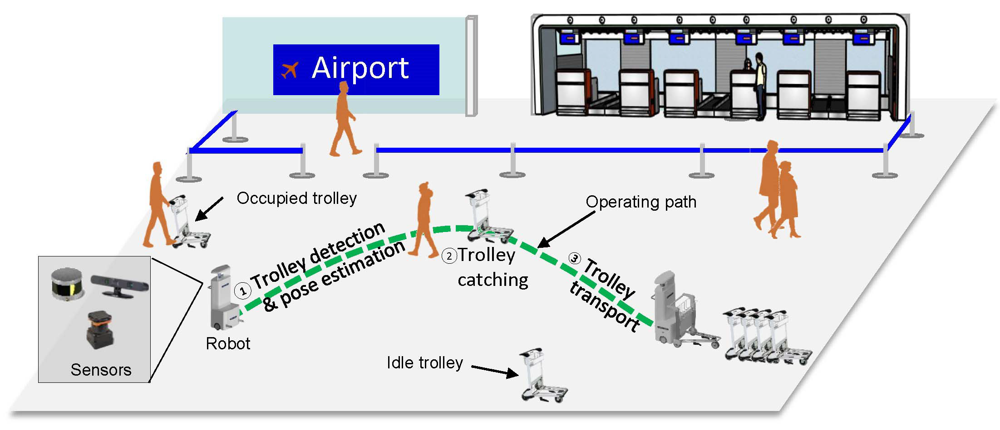


<!--
# Robotic Autonomous Trolley Collection
-->

## Description

 
    (Trolley collection robots working at an airport<a href="#foot1">[1]</a>. )

-   This work presents a novel mobile robotic manipulation system with applications in luggage trolley collection. The proposed system integrates a compact hardware design and a progressive perception and planning framework, enabling the system to efficiently and robustly collect trolleys in dynamic and complex environments. 
-   To the perception end, we develop a 3D trolley detection method that combines object detection and keypoint estimation. A docking process at a short distance featuring an accurate point-cloud-based plane detection method is also developed. 
-   To the planning end, we formulate the robot’s real-time motion planning under a nonlinear model predictive control (NMPC) framework with control barrier functions (CBF). In this way, we are able to improve the obstacle avoidance capability of the robot while taking active observations (maintaining the target in the sensors’ field of view) into account when planning at close distances. 
-   We demonstrate our design and framework by deploying the system on actual trolley collection tasks, involving both static obstacles and moving humans. The effectiveness and robustness of the system are experimentally validated. 

 
 

## Contributions

Our contributions are four-fold. Concretely, we 
1.  develop a novel robotic autonomous trolley collection system integrating a mechanical system and an efficient autonomy framework; 
2.  propose a progressive perception strategy involving long-distance keypoints-based monocular 3D detection and short-distance accurate pose estimation using LiDARs;
3.  present a safety-critical motion planner formulation under an NMPC framework with CBFs considering obstacle avoidance and observation constraints;
4.  demonstrate the system in complex and dynamic environments detecting target trolleys and safely collecting the trolleys. 

 
 

## Demo

-   A demo video of deploying our system in a complex and dynamic environment to accomplish an actual trolley collection task. 

<iframe width="1280" height="720" src="https://www.youtube.com/embed/1N25RQcKaw4" title="YouTube video player" frameborder="0" allow="accelerometer; autoplay; clipboard-write; encrypted-media; gyroscope; picture-in-picture" allowfullscreen></iframe>
(YouTube link <a href="https://youtu.be/1N25RQcKaw4">here</a>)

 

<iframe width="960" height="540" src="https://player.bilibili.com/player.html?aid=335841708&bvid=BV18R4y1n7si&cid=417244637&page=1" scrolling="no" border="0" frameborder="no" framespacing="0" allowfullscreen="true"> </iframe>
 
(bilibili link <a href="https://www.bilibili.com/video/BV1MK4y1P7vd/">here</a> for friends inside the GFW)

 
 

## Future Work

-   Global decision-making
    -   Perception-aware planning
-   Multi-robot collaborative manipulation. 
-   Safe human-robot interaction: 
    -   human model building, tracking, and prediction
    -   considering the interactive nature of autonomous agents (humans & other robots) 
    -   safety-critical planning under uncertainty
-   Field deployment at real-world international airports. 

 
 

## Related publications

\* indicates co-first authors. 

-   A. Xiao\*, H. Luan\*, Z. Zhao\*, Y. Hong, J. Zhao, J. Wang, and M. Q.-H. Meng. "Robotic autonomous trolley collection with progressive perception and nonlinear model predictive control." *2022 International Conference on Robotics and Automation (ICRA)*. Accepted. 2022.
    -   Preprint on arXiv: [https://arxiv.org/abs/2110.06648](https://arxiv.org/abs/2110.06648). 

 
 

#### Reference

<a id="foot1">[1] C. Wang <i>et al</i>., "Coarse-to-Fine Visual Object Catching Strategy Applied in Autonomous Airport Baggage Trolley Collection," in <i>IEEE Sensors Journal</i>, vol. 21, no. 10, pp. 11844-11857, 2021, doi: 10.1109/JSEN.2020.3022459.</a> 

