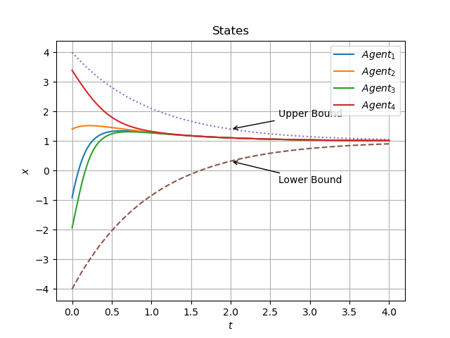



See  a complete version of [downloadable CV (PDF)](https://edmundluan.github.io/files/CV_HaoLuan.pdf) for details. 

## Education

### Harbin Institute of Technology, Shenzhen

- B.E. in Automation (Control Science and Engineering), Aug. 2017 ~ Jul. 2021 (expected) 

    - Undergraduate Academic Merit Scholarship winner. 

### Guangdong Experimental High School

- General High School Diploma, Sep. 2014 ~ Jun. 2017 

## Experience

* Undergraduate Research Assistant, MAS Lab @ [**Harbin Institute of Technology, Shenzhen**](http://www.hitsz.edu.cn/index.html), Oct. 2019 ~ Present 
* Visiting Research Student, Robotic Laboratory @ [**Sun Yat-sen University**](http://sysu.edu.cn/en/index.htm), Nov. 2015 ~ May 2016 

## Selected Projects

### Distributed Consensus of Constrained MAS under Directed Graphs (Ongoing)

-   Advisor: Prof. [Jie Mei](http://faculty.hitsz.edu.cn/meijie) ([Google Scholar](https://scholar.google.com/citations?user=tyQm5IkAAAAJ)) 

-   Description: 
    -   Consensus of multi-agent systems(MAS) has wide applications. Many consensus control algorithms have been proposed. However, state-of-the-art algorithms do not work well in realistic conditions. On one hand, MAS in real-life situations have various constraints, e.g. kinematic constraints, actuator saturation, safety concerns, etc., along with parameter uncertainties and disturbances. On the other hand, most algorithms assume that any point in the state spaces of agents is legit and therefore they do not have guarantees on not breaking the predesignated constraints. 
    -   In this project, we investigate **distributed** consensus control algorithms for MAS with **time-varying state constraints**, parameter uncertainties and external disturbances. We hope to extend applications of MAS into realistic scenarios involving the above conditions. 
    -   Theoretical proof, numerical simulation and possibly physical experiments will be presented. Stay tuned. 

### Vision-Based Auto Parking

-   Advisor: Prof. [Haoyao Chen](http://nrs-lab.com/people/) 
-   Team: Jiahao Fang, Hao Luan, Weijie Wu. 
-   Identified a specific parking sign by adopting filtering, color segmentation, perspective transformation, Canny edge detection and rectangle envelope. 
-   Designed an online closed-loop controller to control angular and linear velocities of an autonomous car, by employing multiple control schemes and using image information of the detected parking sign. 
-   Integrated searching, detection, and motion control on ROS and successfully realized fully automated parking.

### Six-Arm Robot Palletizing 

-   Advisor: Prof. [Yunjiang Lou](http://faculty.hitsz.edu.cn/louyunjiang?lang=en) ([Google Scholar](https://scholar.google.com/citations?user=8Ulrn3cAAAAJ))  
-   Team: Hao Luan, Fangcheng Zhu 
-   Designed robot manipulator control algorithms using forward and inverse kinematics and LFPB trajectory planning. Built position management system to add, store, modify and delete position information of objects. 
-   Achieved fast palletizing motions with high accuracy.

<video src="../videos/Palletize.mp4" controls="controls">
(Due to regulations of the laboratory, )

<!--
Publications
======
  <ul>
    
  </ul>

Talks
======
  <ul>
    
  </ul>

Teaching
======
  <ul>
    
  </ul>

Leadership
======

* Currently signed in to 43 different slack teams

-->

