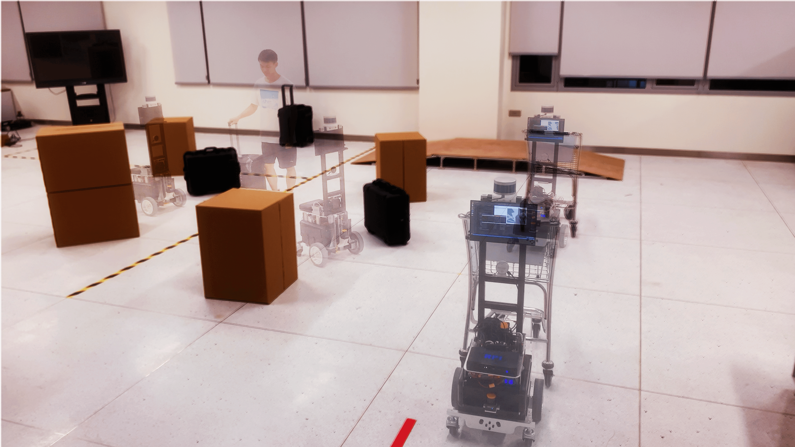



### TOC
[Robotic Autonomous Trolley Collection](#robotic-autonomous-trolley-collection)  
[Distributed Consensus of Constrained MAS under Directed Graphs](#distributed-consensus-of-constrained-mas-under-directed-graphs)  
[Vision-Based Auto Parking](#vision-based-auto-parking)  
[Six-Arm Robot Palletizing](#six-arm-robot-palletizing)  
[Line Patrolling Robot](#line-patrolling-robot)  
[Stable Controller Design for Inverted Pendulum](#stable-controller-design-for-inverted-pendulum)  
[Stable Controller Design for Magnetic Levitation](#stable-controller-design-for-magnetic-levitation)  
[Centralized Multi-Robot Task Allocation](#centralized-multi-robot-task-allocation)  

---
## Robotic Autonomous Trolley Collection

 
(An autonomous robotic collecting system incororating detection, safe navigation, manipulation, and transportation.)

-   Advisors: Prof. [Max Q.-H. Meng](https://www.ee.cuhk.edu.hk/~qhmeng/about.html) ([*Fellow, IEEE*](https://ieeexplore.ieee.org/author/37274117000)); Dr. [Jiankun Wang](https://jkwang1992.github.io/) 

-   Our vision is to bring about a systematic solution to **robotic autonomous trolley collection in complex and dynamic large-scale environments**, like international airports. 
-   This integrated system renders itself a challenge involving object detection, estimation & prediction, localization, efficient & safe planning and control, and robust mechanical design. 
-   Details will be disclosed in our [*ICRA 2022* paper](/publication/xiao_robotic_ICRA2022/).  

<iframe width="1280" height="720" src="https://www.youtube.com/embed/1N25RQcKaw4" title="YouTube video player" frameborder="0" allow="accelerometer; autoplay; clipboard-write; encrypted-media; gyroscope; picture-in-picture" allowfullscreen></iframe>
(YouTube link  <a href="https://youtu.be/1N25RQcKaw4">here</a>)

 

<!--
-   Please see [this page](/cameras/) for details. 
-->

 
 

---
## Distributed Consensus of Constrained MAS under Directed Graphs

 
(Simulation results powered by <a href="https://www.robotarium.gatech.edu/">the Robotarium</a> )

-   Advisor: Prof. [Jie Mei](http://faculty.hitsz.edu.cn/meijie) ([Google Scholar](https://scholar.google.com/citations?user=tyQm5IkAAAAJ)) 

-   We aim to provide a **distributed leaderless consensus** algorithm framework for a type of continuous-time linear multi-agent systems with **time-varying asymmetric state constraints**, uncertainties, and disturbances under time-varying directed topologies. 
-   Theoretical proof, numerical simulations and physical experiments are presented. 
-   Please see [this page](/cameras/) for details. 

 
 

---
## Vision-Based Auto Parking

-   Advisor: Prof. [Haoyao Chen](http://nrs-lab.com/people/) 
-   Team: Jiahao Fang, **Hao Luan**, Weijie Wu. 
-   Identified a specific parking sign by adopting filtering, color segmentation, perspective transformation, Canny edge detection and rectangle envelope. 
-   Designed an online closed-loop controller to control angular and linear velocities of an autonomous car, by employing multiple control schemes and using image information of the detected parking sign. 
-   Integrated searching, detection, and motion control on ROS and successfully realized fully automated parking.
<video src="../videos/AutoPark.mp4" width="560" height="315" align="center" controls autoplay loop ></video>

 
 

---
## Six-Arm Robot Palletizing 

-   Advisor: Prof. [Yunjiang Lou](http://faculty.hitsz.edu.cn/louyunjiang?lang=en) ([Google Scholar](https://scholar.google.com/citations?user=8Ulrn3cAAAAJ))  
-   Team: **Hao Luan**, Fangcheng Zhu 
-   Designed robot manipulator control algorithms using forward and inverse kinematics and LFPB trajectory planning. Built position management system to add, store, modify and delete position information of objects. 
-   Achieved fast palletizing motions with high accuracy.

<!--

<iframe width="560" height="315" src="https://www.youtube.com/embed/WScgMeEDBrM?loop=1&autoplay=1" frameborder="0" allow="accelerometer; autoplay; clipboard-write; encrypted-media; gyroscope; picture-in-picture;loop" allowfullscreen></iframe>
--->
<video src="../videos/Palletize.mp4" width="560" height="315" controls autoplay loop align="center"></video>

(Due to regulations of the laboratory, we were only allowed to operate the machine with 25% of its max speed, so this video is played with 4X fast forward.)

 
 

---
## Line Patrolling Robot

-   Advisor: Prof. Haoyao Chen
-   Team: **Hao Luan**, Fangcheng Zhu. 
-   Designed and 3D-printed structural parts, built electric circuits connecting basic modules including H bridges and DC motors, and used Arduino microcontroller to realize feedback control of the speed of DC motors with encoders.
-   Designed a hybrid PID control algorithm based on the infrared sensors to control the robot tracking the desired black line.
-   Integrated the hardware system, tested the robot and the algorithm in a complex map, and finished the task in 30s.

<video src="../videos/line.mp4" width="560" height="315" align="center" controls autoplay loop ></video>

(This video is only a test, not the final version of our robot.)

 
 

---
## Stable Controller Design for Inverted Pendulum 

-   Advisor: Prof. [Ai-Guo Wu](https://ieeexplore.ieee.org/author/38182430000) 
-   Modeled and linearized the inverted pendulum system in transfer function model and state space model respectively. 
-   Designed a controller via second-, third-, and fourth-order state feedback respectively using poles placement techniques. 
-   Designed a controller via output feedback using the root locus method. 

<video src="../videos/InvertedPendulum.mp4" width="560" height="315" controls autoplay loop align="center"></video>

 
 

---
## Stable Controller Design for Magnetic Levitation 

-   Advisor: Prof. Ai-Guo Wu 
-   Modeled the magnetic levitation system and obtained its linearized plant model in transfer function. 
-   Designed a feedback controller using the root locus method. 

 
 

---
## Centralized Multi-Robot Task Allocation

-   Advisor: Prof. [Hui Cheng](https://sdcs.sysu.edu.cn/content/2504) @ SYSU 
-   Team: **Hao Luan**, Yanheng Wang, Zihao Zeng. 
-   Designed and implemented a centralized offline task-allocation algorithm for multi-robot systems based on the Ant Colony System. 
-   Compared with a conventional optimal DFS algorithm, simulation showed time-consuming ratios down to 1/2400 and relative errors below 10% in dense directed graphs consisting of up to 20 vertices. 

