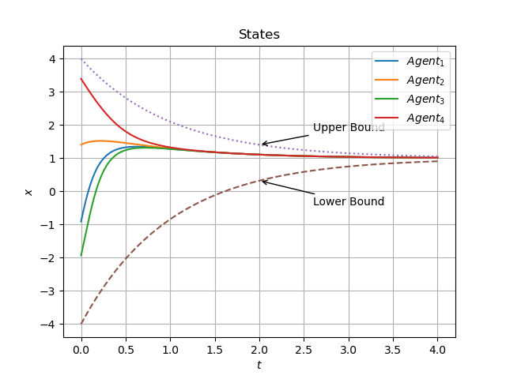



## Distributed Consensus of Constrained MAS under Directed Graphs (Ongoing)

-   Advisor: Prof. [Jie Mei](http://faculty.hitsz.edu.cn/meijie) ([Google Scholar](https://scholar.google.com/citations?user=tyQm5IkAAAAJ)) 

-   Description: 
    -   Consensus of multi-agent systems(MAS) has wide applications. Many consensus control algorithms have been proposed. However, state-of-the-art algorithms do not work well in realistic conditions. On one hand, MAS in real-life situations have various constraints, e.g. kinematic constraints, actuator saturation, safety concerns, etc., along with parameter uncertainties and disturbances. On the other hand, most algorithms assume that any point in the state spaces of agents is legit and therefore they do not have guarantees on not breaking the predesignated constraints. 
    -   In this project, we investigate **distributed** consensus control algorithms for MAS with **time-varying state constraints**, parameter uncertainties and external disturbances. We hope to extend applications of MAS into realistic scenarios involving the above conditions. 
    -   Theoretical proof, numerical simulation and possibly physical experiments will be presented. Stay tuned. 

## Vision-Based Auto Parking

-   Advisor: Prof. [Haoyao Chen](http://nrs-lab.com/people/) 
-   Team: Jiahao Fang, **Hao Luan**, Weijie Wu. 
-   Identified a specific parking sign by adopting filtering, color segmentation, perspective transformation, Canny edge detection and rectangle envelope. 
-   Designed an online closed-loop controller to control angular and linear velocities of an autonomous car, by employing multiple control schemes and using image information of the detected parking sign. 
-   Integrated searching, detection, and motion control on ROS and successfully realized fully automated parking.

## Six-Arm Robot Palletizing 

-   Advisor: Prof. [Yunjiang Lou](http://faculty.hitsz.edu.cn/louyunjiang?lang=en) ([Google Scholar](https://scholar.google.com/citations?user=8Ulrn3cAAAAJ))  
-   Team: **Hao Luan**, Fangcheng Zhu 
-   Designed robot manipulator control algorithms using forward and inverse kinematics and LFPB trajectory planning. Built position management system to add, store, modify and delete position information of objects. 
-   Achieved fast palletizing motions with high accuracy.

<video src="../videos/Palletize.mp4" controls autoplay loop>

(Due to regulations of the laboratory, we were only allowed to operate the machine with 25% of its max speed, so this video is played with 4X fast forward.)

## Line Patrolling Robot

-   Advisor: Prof. Haoyao Chen
-   Team: Jiahao Fang, **Hao Luan**, Weijie Wu. 
-   Designed and 3D-printed structural parts, built electric circuits connecting basic modules including H bridges and DC motors, and used Arduino microcontroller to realize feedback control of the speed of DC motors with encoders.
-   Designed a hybrid PID control algorithm based on the infrared sensors to control the robot tracking the desired black line.
-   Integrated the hardware system, tested the robot and the algorithm in a complex map, and finished the task in 30s.

<video src="../videos/line.mp4" width="500" height="400" controls autoplay loop>

(This video is only a test, not the final version of our robot.)

## Stable Controller Design for Inverted Pendulum 

-   Advisor: Prof. [Ai-Guo Wu](https://ieeexplore.ieee.org/author/38182430000) 
-   Modeled and linearized the inverted pendulum system in transfer function model and state space model respectively. 
-   Designed a controller via second-, third-, and fourth-order state feedback respectively using poles placement techniques. 
-   Designed a controller via output feedback using the root locus method. 

<video src="../videos/InvertedPendulum.mp4" controls autoplay loop>

## Stable Controller Design for the Magnetic Levitation 

-   Advisor: Prof. Ai-Guo Wu 
-   Modeled the magnetic levitation system and obtained its linearized plant model in transfer function. 
-   Designed a feedback controller using the root locus method. 

